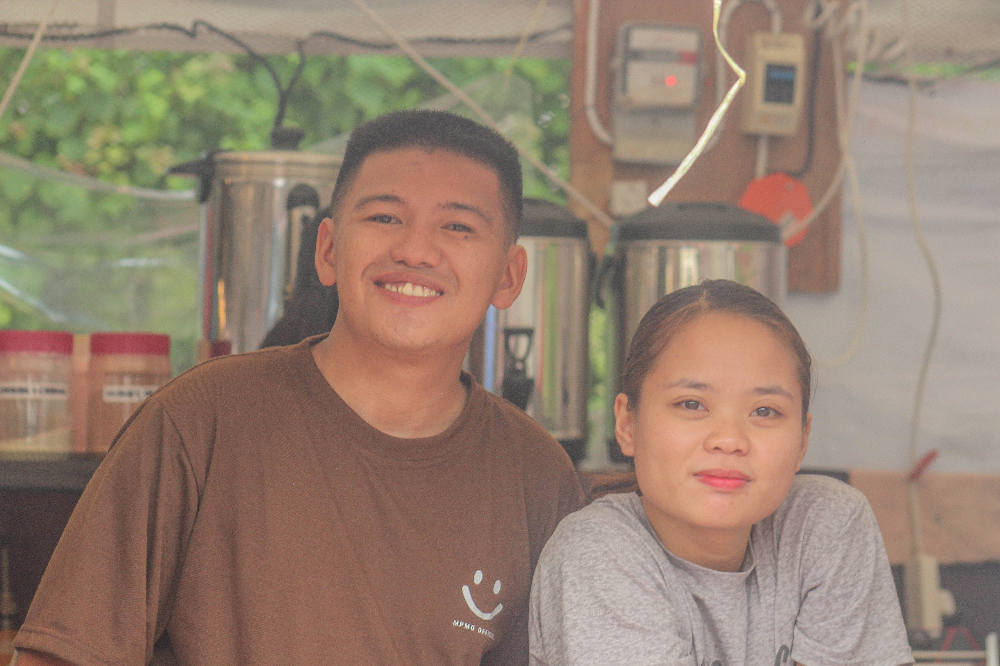
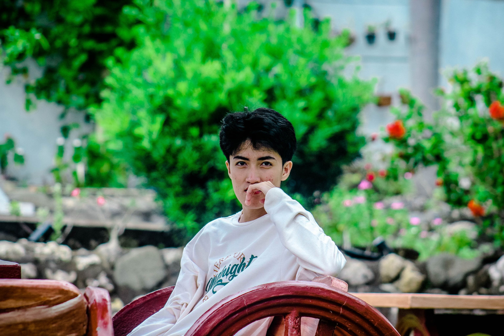
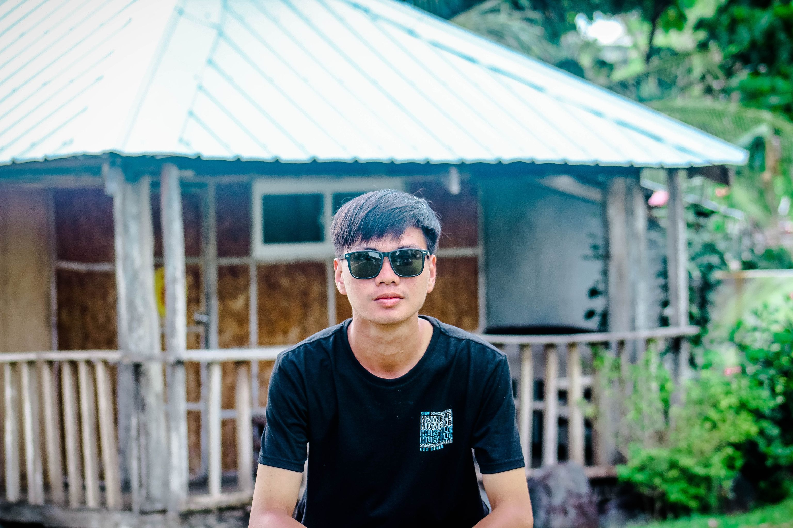

<!DOCTYPE html>
<html lang="en">
	<head>
		<meta charset="utf-8">
		<meta http-equiv="X-UA-Compatible" content="IE=edge">
		<meta name="viewport" content="width=device-width, initial-scale=1">
		<!-- The above 3 meta tags *must* come first in the head; any other head content must come *after* these tags -->
		<meta name="description" content="">
		<meta name="author" content="">
		<link rel="icon" href="favicon.ico">
		<title>ChriShots</title>
		<!-- Bootstrap core CSS -->
		<link href="css/bootstrap.min.css" rel="stylesheet">
		<link rel="stylesheet" href="https://maxcdn.bootstrapcdn.com/font-awesome/4.4.0/css/font-awesome.min.css">
		<!-- Custom styles for this template -->
		<link href="css/owl.carousel.css" rel="stylesheet">
		<link href="css/owl.theme.default.min.css"  rel="stylesheet">
		<link href="css/style.css" rel="stylesheet">
		<!-- Just for debugging purposes. Don't actually copy these 2 lines! -->
		<!--[if lt IE 9]><![endif]-->
		
		<!-- HTML5 shim and Respond.js for IE8 support of HTML5 elements and media queries -->
		<!--[if lt IE 9]>
		
		
		<![endif]-->

		<link rel="shortcut icon" href="./ChriShots.png" type="image/svg+xml">
	</head>
	<body id="page-top">
		<!-- Navigation -->
		<nav class="navbar navbar-default navbar-fixed-top">
			

				<!-- Brand and toggle get grouped for better mobile display -->
				

					<button type="button" class="navbar-toggle" data-toggle="collapse" data-target="#bs-example-navbar-collapse-1">
					Toggle navigation
					
					
					
					</button>
					
				

				<!-- Collect the nav links, forms, and other content for toggling -->
				

					<ul class="nav navbar-nav navbar-right">
						<li class="hidden">
							
						</li>
						<li>
							<a class="page-scroll" href="#about">About</a>
						</li>
						<li>
							<a class="page-scroll" href="#team">Team</a>
						</li>
					</ul>
				

				<!-- /.navbar-collapse -->
			

			<!-- /.container-fluid -->
		</nav>
		<!-- Header -->
		<header>
			

				

					

						
Welcome To Our Page!

						
ChriShots At Your Service

						<a href="https://see-for-more.github.io/" class="page-scroll btn btn-xl">See For More</a>
					

				

			

		</header>
		<section id="about" class="light-bg">
			

				

					

						

							<h2>ABOUT</h2>
							
Welcome to ChriShots, where Capturing Life's Timeless Moments is captured with passion, precision, and creativity. Established with a vision to freeze time and immortalize memories, ChriShots is more than just a service; it's a journey of storytelling through the lens.

							At ChriShots, we understand the importance of preserving life's precious moments. Whether it's a wedding, a Birthday Shoot , a family gathering, a corporate event, or a personal portrait session, we believe in capturing the essence of every moment with authenticity and finesse.

							Led by Christian and Josee, our founder and principal photographer, ChriShots brings a wealth of experience, creativity, and professionalism to every project. With a keen eye for detail and a dedication to excellence, Christian and Josee and his team strive to deliver images that not only meet but exceed your expectations.

							What sets us apart is our personalized approach to photography. We believe that every client is unique, and so are their stories. That's why we take the time to understand your vision, your style, and your preferences, ensuring that every photograph reflects your personality and emotions.

							From the initial consultation to the final delivery of your images, we are committed to providing you with a seamless and enjoyable experience. Our goal is not just to take pictures, but to create timeless works of art that you will cherish for years to come.

							Thank you for considering ChriShots to be a part of your special moments. We look forward to capturing memories with you and turning them into beautiful stories that last a lifetime.

						

					

				

				

					<!-- about module -->
					

						

							<i class="fa fa-film ot-circle"></i>
							<h3>Film</h3>
							
We've got some Film Coverage Where every frame tells a unique story.

						

					

					<!-- end about module -->
					<!-- about module -->
					

						

							<i class="fa fa-edit ot-circle"></i>
							<h3>Graphic Design</h3>
							
We've got some Design have made.

						

					

					<!-- end about module -->
					<!-- about module -->
					

						

							<i class="fa fa-camera-retro ot-circle"></i>
							<h3>Photography</h3>
							
We've got some Photography Where Capturing Life's Timeless Moments.

						

					

					<!-- end about module -->
					<!-- about module -->
					

						

							<i class="fa fa-cube ot-circle"></i>
							<h3>Food Promoting</h3>
							
We Take Food Promoting To Be Advertise

						

					

					<!-- end about module -->
				

			

			<!-- /.container -->
		</section>
		<section >
			

				

					

						

							<h2>WE`RE CREATIVE</h2>
							
"Where every frame tells a unique story, capturing memories

							
with passion, skill, and creativity."

						

					

					

						<!-- skill bar item -->
						

							

								90%
							

							

								<h3>Photography</h3>
								

									

									

								

							

						

						<!-- skill bar item -->
						

							

								82%
							

							

								<h3>Graphic design</h3>
								

									

									

								

							

						

						<!-- skill bar item -->
						

							

								86%
							

							

								<h3>Videography</h3>
								

									

									

								

							

						

						<!-- skill bar item -->
						

							

								80%
							

							

								<h3>Product Promotion</h3>
								

									

									

								

							

						

					

				

			

		</section>
		<section class="overlay-dark bg-img1 dark-bg short-section">
			

				

					

						

							<h2 data-count="60">60</h2>
							<h6>Clients</h6>
						

					

					

						

							<h2 data-count="3">3</h2>
							<h6>Team</h6>
						

					

					

						

							<h2 data-count="116">116</h2>
							<h6>Project</h6>
						

					

					

						

							<h2 data-count="70">70</h2>
							<h6>Food Promoting</h6>
						

					

				

			

		</section>

		<section>
			

				

					

					

				

			

		</section>
		<section id="team" class="light-bg">
			

				

					

						

							<h2>Our Team</h2>
							
A creative Photography, Ready to boost your confidence with some beautifull captures. ChriShots is one of the best in Creative Photograph see more you will be amazed.

						

					

				

				

					<!-- team member item -->
					

						

							

								
							

							

								<h3>Chris & Josee</h3>
								
Iriga, Camarines Sur

								
– CEO, Photographer and Designer –

								
Visionary CEO, versatile photographer, designer.

							

						

					

					<!-- end team member item -->
					<!-- team member item -->
					

						

							

								
							

							

								<h3>Zandrev Ayubo</h3>
								
Iriga, Camarines Sur

								
– Photographer –

								
Passionate, creative, dedicated photographer.

							

						

					

					<!-- end team member item -->
					<!-- team member item -->
					

						

							

								
							

							

								<h3>Arnel Almelor</h3>
								
Iriga, Camarines Sur

								
– Videographer –

								
Creative storyteller behind the lens.

							

						

					

					<!-- end team member item -->
				

			

		</section>

		

			<a href="#top"><i class="fa fa-angle-up"></i></a>
		

		<footer>
			

				
Designed by <a href="https://www.facebook.com/ChriShotssss">ChriShots</a>

			

		</footer>

		<!-- Modal for portfolio item 1 -->
		

			

				

					

						<button type="button" class="close" data-dismiss="modal" aria-label="Close">&times;</button>
						<h4 class="modal-title" id="Modal-label-1">Libereta Photoshoot</h4>
					

					

						
						
Birthday Photoshoot

						
"Embracing another year of Liberata's journey, surrounded by the timeless beauty of nature and kissed by the warm hues of a sunset." 🌅✨

					

					

						<button type="button" class="btn btn-default" data-dismiss="modal">Close</button>
					

				

			

		

		<!-- Modal for portfolio item 2 -->
		

			

				

					

						<button type="button" class="close" data-dismiss="modal" aria-label="Close">&times;</button>
						<h4 class="modal-title" id="Modal-label-2">Mr. & Mrs. Judavar</h4>
					

					

						
						
Wedding

						
Mr. Jordan & Mrs. Clarivic Judavar Wedding

					

					

						<button type="button" class="btn btn-default" data-dismiss="modal">Close</button>
					

				

			

		

		<!-- Modal for portfolio item 3 -->
		

			

				

					

						<button type="button" class="close" data-dismiss="modal" aria-label="Close">&times;</button>
						<h4 class="modal-title" id="Modal-label-3">Dea's Baptismal</h4>
					

					

						
						
Baptismal

						
“𝐀𝐬 𝐭𝐡𝐞 𝐝𝐫𝐨𝐩𝐥𝐞𝐭𝐬 𝐨𝐟 𝐰𝐚𝐭𝐞𝐫 𝐚𝐫𝐞 𝐩𝐥𝐚𝐜𝐞𝐝 𝐮𝐩𝐨𝐧 𝐲𝐨𝐮, 𝐲𝐨𝐮 𝐚𝐫𝐞 𝐰𝐫𝐚𝐩𝐩𝐞𝐝 𝐢𝐧 𝐆𝐨𝐝’𝐬 𝐩𝐫𝐞𝐜𝐢𝐨𝐮𝐬 𝐥𝐨𝐯𝐞. 𝐌𝐚𝐲 𝐡𝐞 𝐛𝐥𝐞𝐬𝐬, 𝐠𝐮𝐢𝐝𝐞 𝐚𝐧𝐝 𝐩𝐫𝐨𝐭𝐞𝐜𝐭 𝐲𝐨𝐮, 𝐤𝐞𝐞𝐩𝐢𝐧𝐠 𝐲𝐨𝐮 𝐬𝐚𝐟𝐞, 𝐡𝐞𝐚𝐥𝐭𝐡𝐲 𝐚𝐧𝐝 𝐡𝐚𝐩𝐩𝐲 𝐟𝐫𝐨𝐦 𝐚𝐛𝐨𝐯𝐞."😇

						
Dea Veronica C. Asaytuno Baptismal Shoot - 11.5.22

					

					

						<button type="button" class="btn btn-default" data-dismiss="modal">Close</button>
					

				

			

		

		<!-- Modal for portfolio item 4 -->
		

			

				

					

						<button type="button" class="close" data-dismiss="modal" aria-label="Close">&times;</button>
						<h4 class="modal-title" id="Modal-label-4">Distreat Treat New Rice Meal</h4>
					

					

						
						
Food Promoting

						
"Experience a culinary adventure like never before at Distreat Treat! There latest menu features tantalizing Rice Meals, Refreshing Slushies, and Mouthwatering Snacks that will leave your taste buds craving for more. Come taste the excitement!" 🍚🥤🍟 

					

					

						<button type="button" class="btn btn-default" data-dismiss="modal">Close</button>
					

				

			

		

		<!-- Bootstrap core JavaScript
			================================================== -->
		<!-- Placed at the end of the document so the pages load faster -->
		
		
		
		
		
		
		<!-- IE10 viewport hack for Surface/desktop Windows 8 bug -->
		
	</body>
</html>
